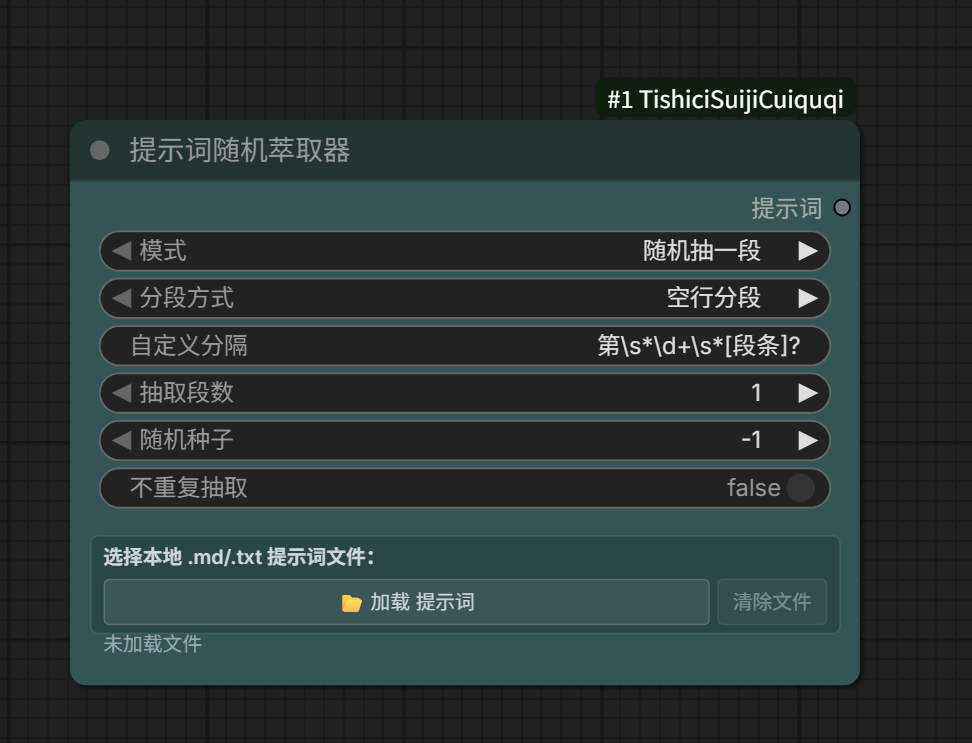

# 提示词随机萃取器 (ComfyUI 節點) / Prompt Random Extractor (ComfyUI Node)

一個純本地的 ComfyUI 自訂節點，用來從 `.md` / `.txt` 提示詞庫裡**隨機抽出一整段**提示詞，直接餵給文生圖 / 圖生圖鏈路。點一下彈出系統檔案選擇框，選檔案即可。

A purely local ComfyUI custom node that **randomly extracts an entire paragraph** of prompts from your `.md` / `.txt` prompt library and feeds it directly into your text-to-image / image-to-image pipeline. Click once to open the system file picker and select a file.



## 📥 下載 v1.0.0 / Download v1.0.0

👉 [**v1.0.0 提示词随机萃取器 / Prompt Random Extractor v1.0.0**](https://github.com/h185085/ComfyUI-TishiciSuijiCuiquqi/releases/download/v1.0.0/TishiciSuijiCuiquqi-1.0.0.zip) —— 點擊文字直鏈下載 zip，解壓後按下方步驟安裝。 / Click the link to download the zip directly; extract and follow the steps below to install.

## 特性 / Features

- 📂 **點擊載入 / Click to Load**：點「📂 載入 提示詞」直接彈檔案管理器選檔案，支援 `.md` / `.txt` / `.prompt` / `.text`，單檔案上限 8MB。 / Click "📂 Load Prompt" to open the file manager and pick a file. Supports `.md` / `.txt` / `.prompt` / `.text`, up to 8MB per file.
- 🎲 **真隨機 / True Random**：每次執行佇列都會重新抽取（已用 `IS_CHANGED` 強制每輪執行，不會被 ComfyUI 快取吃掉）。 / Re-extracts on every queue run (uses `IS_CHANGED` to force execution each turn, bypassing ComfyUI's cache).
- ✂️ **整段不切碎 / Whole Paragraph Only**：以「段」為最小單位，絕不從段落中間截斷。 / Always returns a complete paragraph — never truncates mid-paragraph.
- 🔁 **不重複抽取 / No-Repeat Mode**：開啟後像抽籤池，抽過的不再抽，抽完一輪自動重置。 / Acts like a draw pool; drawn items are not repeated until the pool resets.
- 🧩 **完全本地 / Fully Local**：檔案讀取發生在瀏覽器（FileReader）與 ComfyUI 本地後端，**不連任何外部 / 雲端 / LLM API**。 / File reading happens in the browser (FileReader) and ComfyUI's local backend — **no external / cloud / LLM API calls**.

## 安裝 / Installation

1. 把整個 `TishiciSuijiCuiquqi` 資料夾放進 ComfyUI 的 `custom_nodes/` 目錄： / Place the entire `TishiciSuijiCuiquqi` folder into ComfyUI's `custom_nodes/` directory:
   ```
   ComfyUI/custom_nodes/TishiciSuijiCuiquqi/
   ├── __init__.py
   ├── tishici_node.py
   └── web/tishici.js
   ```
2. 重啟 ComfyUI。 / Restart ComfyUI.
3. 在節點列表搜尋「**提示词随机萃取器**」即可拖出使用。 / Search "**提示词随机萃取器**" in the node list to add it.

## 使用 / Usage

1. 雙擊節點，點「📂 載入 提示詞」選一個提示詞檔案。 / Double-click the node, then click "📂 Load Prompt" to pick a prompt file.
2. 狀態欄顯示「已載入：xxx.md」。 / The status bar shows "已載入：xxx.md".
3. 設參數： / Set the parameters:
   - **模式 / Mode**：`随机抽一段` / `返回全文` — Random paragraph / Full text
   - **分段方式 / Split mode**：`空行分段` / `每行一段` / `自定義正則` — Blank-line split / Per-line split / Custom regex
   - **抽取段数 / Count**：一次抽幾條（預設 1）— How many paragraphs per run (default 1)
   - **随机种子 / Seed**：`-1` = 每次真隨機；填具體數字可復現同一段 — `-1` = fresh random each time; a fixed number reproduces the same paragraph
   - **不重複抽取 / No-repeat**：抽籤池模式 — Draw-pool mode
4. 把節點的 `提示詞` 輸出接到 Qwen 圖像推理等節點的文字輸入口。 / Connect the node's `提示詞` output to the text input of nodes such as Qwen image inference.
5. 每次跑佇列都會重新隨機抽，連續出圖就能拿到不同提示詞。 / Every queue run re-extracts randomly, so consecutive generations use different prompts.

## 參數說明 / Parameters

| 參數 / Parameter | 說明 / Description |
|---|---|
| 模式 / Mode | 随机抽一段 / 返回全文 — Random paragraph / Full text |
| 分段方式 / Split mode | 空行分段（推薦）、每行一段、自定義正則（如 `第\s*\d+\s*[段条]?`）— Blank-line (recommended), per-line, or custom regex (e.g. `第\s*\d+\s*[段条]?`) |
| 抽取段数 / Count | 一次抽取段落数，1~50 — Paragraphs per run, 1–50 |
| 随机种子 / Seed | -1 真隨機；固定值可復現 — -1 true random; fixed value reproducible |
| 不重複抽取 / No-repeat | 抽過的不再抽，抽完一輪自動重置 — Drawn items excluded until the pool resets |

## 注意事項 / Notes

- 檔案內容會隨工作流保存，大檔案會讓工作流 `.json` 變大（8MB 上限內）。 / File contents are saved with the workflow, so large files enlarge the `.json` (within the 8MB limit).
- 節點強制每輪執行，因此**每次執行都會消耗一次隨機抽取**——這正是隨機出圖想要的。 / The node forces execution every turn, so **each run consumes one random draw** — exactly what randomized generation needs.

## 許可證 / License

MIT
